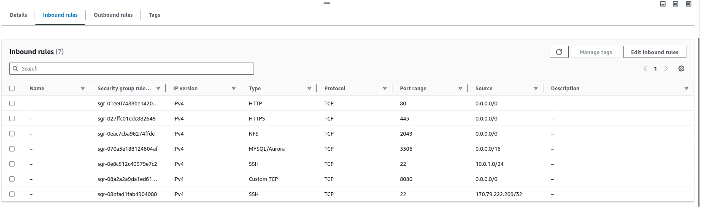
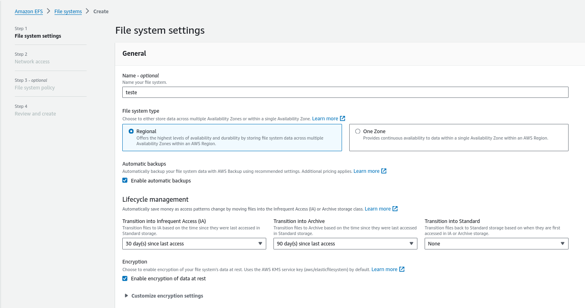
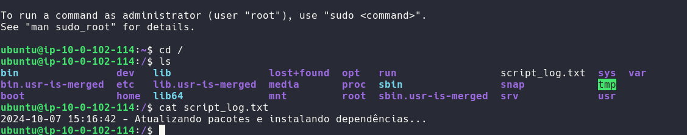
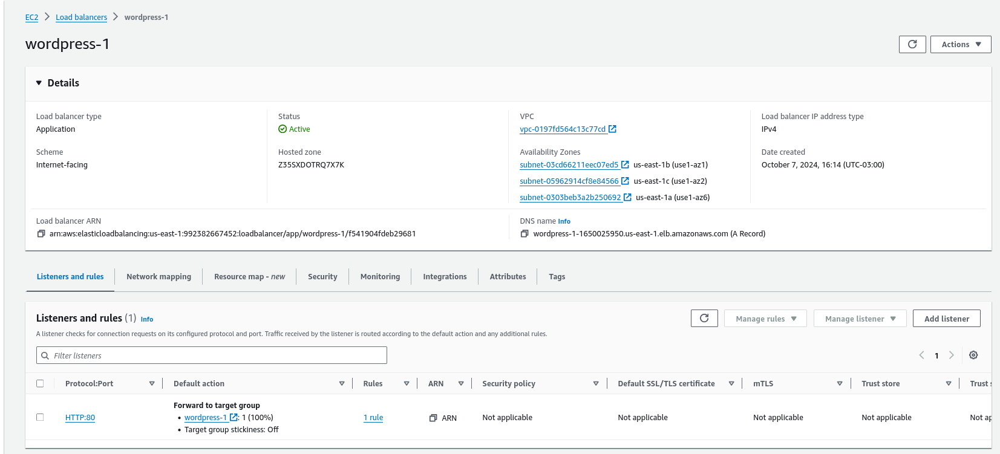

# AWS - CONTAINERS
## Overview

This document outlines the steps to deploy a scalable WordPress application on AWS using the following components:

   - Amazon EC2 instances for hosting WordPress
   - Auto Scaling Group for scaling EC2 instances
   - Amazon RDS MySQL instance for the database
   - Elastic Load Balancer (ELB) to distribute traffic
   - Elastic File System (EFS) for static content storage

The deployment ensures high availability across multiple availability zones (AZs) and uses a private RDS instance, with traffic routed through the Load Balancer.
Architecture

The setup follows a classic three-tier architecture:

   - Web Tier: EC2 instances hosting WordPress.
   - Database Tier: RDS MySQL instance in a private subnet.
   - Load Balancer: Routes HTTP/HTTPS traffic to the EC2 instances.


## 1. Create a EC2 template

- Go to EC2 console
- Create a new template
- Name it "wordpress-template"
- Select "ubuntu 20.04 LTS" as the base image
- Select "t2.micro" as the instance type
- Add a volume of 16 GB
- select key pair "Wordpress"
- Add a security group with the name "sg-wordpress-ec2"
- Advanced details
  - Add user data:
```bash
#!/bin/bash

# Saia do script se algum comando falhar
set -e

# Definir o arquivo de log
LOG_FILE="script_log.txt"

# Função para registrar mensagens no log e no terminal
log() {
  echo "$(date +'%Y-%m-%d %H:%M:%S') - $1" | tee -a "$LOG_FILE"
}

# Atualiza e instala pacotes necessários
log "Atualizando pacotes e instalando dependências..."
sudo apt-get update -y
sudo apt-get upgrade -y
sudo apt-get install -y snapd git mysql-client nfs-common

# Instala AWS CLI
log "Instalando AWS CLI..."
sudo snap install aws-cli --classic

# Instala Docker
log "Instalando Docker..."
sudo snap install docker

# Certifique-se de que o Docker está rodando
log "Esperando Docker iniciar..."
sleep 10

# Instala o Docker Compose
DOCKER_COMPOSE_VERSION="1.29.2"  # Versão do Docker Compose
log "Instalando Docker Compose versão $DOCKER_COMPOSE_VERSION..."
sudo curl -L "https://github.com/docker/compose/releases/download/${DOCKER_COMPOSE_VERSION}/docker-compose-$(uname -s)-$(uname -m)" -o /usr/local/bin/docker-compose
sudo chmod +x /usr/local/bin/docker-compose

# Verifica a instalação do Docker Compose
log "Verificando Docker Compose..."
sudo docker-compose --version

# Define as variáveis de ambiente do RDS
DB_HOST="database-wordpress-mysql.x.us-east-1.rds.amazonaws.com"
DB_USER="x"
DB_PASSWORD="x"
DB_NAME="x"

# Cria o arquivo .env para armazenar as variáveis de ambiente
log "Criando arquivo .env com as variáveis de ambiente..."
cat <<EOF > .env
DB_HOST=$DB_HOST
DB_USER=$DB_USER
MYSQL_PWD=$DB_PASSWORD
DB_NAME=$DB_NAME
EOF

# Verifica se o banco de dados já existe, se não, cria o banco de dados
log "Verificando ou criando banco de dados $DB_NAME..."
export MYSQL_PWD="$DB_PASSWORD"
mysql --host="$DB_HOST" --user="$DB_USER" --execute="CREATE DATABASE IF NOT EXISTS $DB_NAME;"

# Testa a conexão com o banco de dados
log "Testando conexão com o banco de dados..."
if mysql --host="$DB_HOST" --user="$DB_USER" --execute="USE $DB_NAME;"; then
    log "Conexão bem-sucedida com o banco de dados $DB_NAME no host $DB_HOST."
else
    log "Falha na conexão com o banco de dados."
    exit 1
fi

# Configura o EFS
EFS_DNS="fs-x.efs.us-east-1.amazonaws.com"
MOUNT_POINT="/mnt/efs"

log "Montando EFS em $MOUNT_POINT..."
sudo mkdir -p $MOUNT_POINT
sudo mount -t nfs4 -o nfsvers=4.1 $EFS_DNS:/ $MOUNT_POINT

# Cria o arquivo docker-compose.yml diretamente no script
log "Criando arquivo docker-compose.yml..."
cat <<EOF > docker-compose.yml
version: '3'
services:
  wordpress:
    image: wordpress:latest
    ports:
      - "80:80"
      - "8080:8080"
    environment:
      WORDPRESS_DB_HOST: \${DB_HOST}:3306
      WORDPRESS_DB_USER: \${DB_USER}
      WORDPRESS_DB_PASSWORD: \${MYSQL_PWD}
      WORDPRESS_DB_NAME: \${DB_NAME}
    volumes:
      - $MOUNT_POINT/wp-content:/var/www/html/wp-content
EOF

# Inicia o ambiente Docker com Docker Compose
log "Iniciando ambiente Docker..."
sleep 10
sudo docker-compose -f /docker-compose.yml up 2>&1 | tee /docker-compose.log

# Exibe mensagem de sucesso
log "O ambiente foi configurado com sucesso e o WordPress está rodando no Docker na porta 8080."
```


### sg-wordpress-ec2


- SSH to private instances can only be accessed from the bastion host.
- The bastion host is a public EC2 instance and SSH is open to my IP.


## Create secure VPC network


Each private subnet goes to a route table whit a route to a public NAT gateway.

All the public subnets go to a public route table with a route to the internet gateway.

All public subnets have a nat gateway, and all private subnets have a route table with a route to the nat gateway.

## RDS


**Security group:**
```
	
sgr-01d21996856dcf27e
	
IPv4
	
MYSQL/Aurora
	
TCP
	
3306
	
0.0.0.0/16
```


## Configuring EFS

   


### EFS Endpoint:

  

## Auto Scaling Group

.png>) .png>) .png>) .png>) .png>) .png>) .png>) .png>)


## IAM:


# Running the application


### EC2 starting script can take up to 10 minutes to run, using a bastion host EC2 we can monitor the progress of the script and see when it is complete.


> Bastion host:


When conectet to this public instance we can enter the private ones created by the auto scaling group using SSH.




Using `htop` we can see the running processes and the memory usage of the EC2 instance.


> Explaning what the script does:
 - Update the packages and install the dependencies.
 - Install Docker.
 - Install Docker Compose.
 - Verify the Docker Compose installation.
 - Create the .env file with the environment variables.
 - Verify the connection to the database.
 - Create the docker-compose.yml file.
 - Start the Docker environment using Docker Compose.
 - Output the logs to a file.


> Accessing the database via internet is impossible:


## Working project

```bash
ubuntu@ip-10-0-103-120:/$ cat script_log.txt 
2024-10-08 03:11:22 - Atualizando pacotes e instalando dependências...
2024-10-08 03:11:57 - Instalando AWS CLI...
2024-10-08 03:12:03 - Instalando Docker...
2024-10-08 03:12:12 - Esperando Docker iniciar...
2024-10-08 03:12:22 - Instalando Docker Compose versão 1.29.2...
2024-10-08 03:12:27 - Verificando Docker Compose...
2024-10-08 03:12:37 - Criando arquivo .env com as variáveis de ambiente...
2024-10-08 03:12:37 - Verificando ou criando banco de dados wordpress...
2024-10-08 03:12:38 - Testando conexão com o banco de dados...
2024-10-08 03:12:38 - Conexão bem-sucedida com o banco de dados wordpress no host database-wordpress-mysql.czoywqsm880e.us-east-1.rds.amazonaws.com.
2024-10-08 03:12:38 - Montando EFS em /mnt/efs...
2024-10-08 03:12:40 - Criando arquivo docker-compose.yml...
2024-10-08 03:12:41 - Iniciando ambiente Docker...
2024-10-08 03:12:51 - O ambiente foi configurado com sucesso e o WordPress está rodando no Docker na porta 8080.
ubuntu@ip-10-0-103-120:/$ cat docker-compose.log
Creating network "default_default" with the default driver
Pulling wordpress (wordpress:latest)...
latest: Pulling from library/wordpress
Digest: sha256:de904d6eb58f7d84c71a8106af01f52caa4651e607c4bc9efe78adbbf4977902
Status: Downloaded newer image for wordpress:latest
Creating default_wordpress_1 ... 

ERROR: for default_wordpress_1  UnixHTTPConnectionPool(host='localhost', port=None): Read timed out. (read timeout=60)


```





